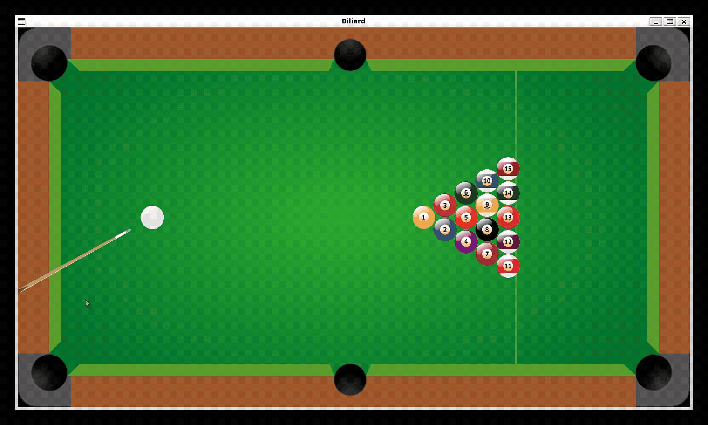
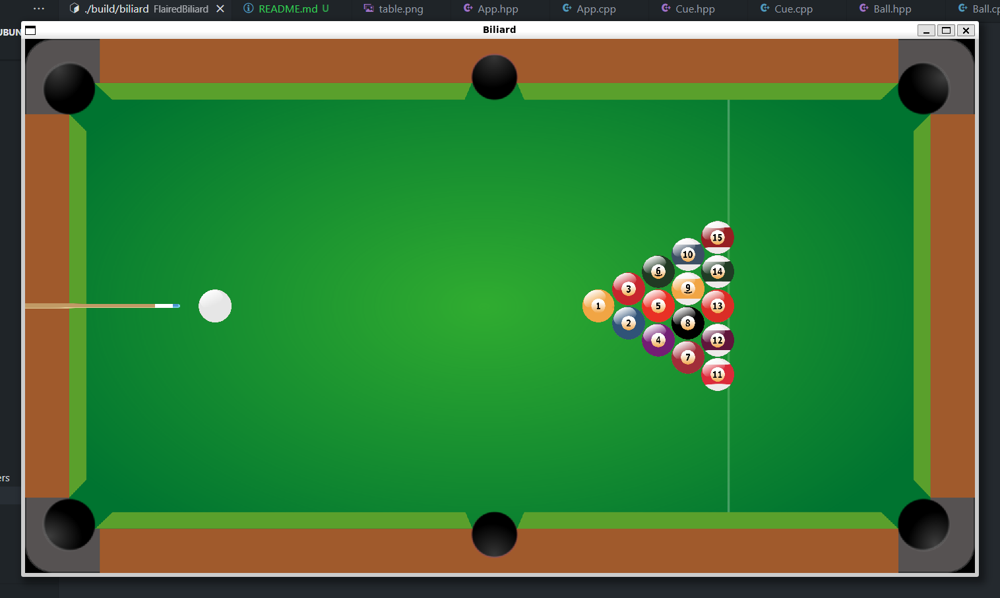
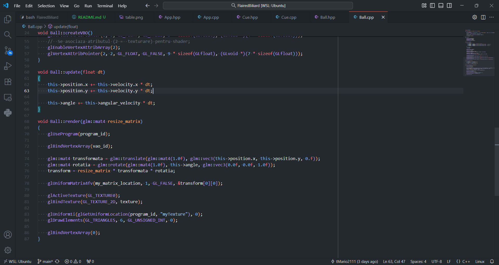

# FlairedBiliard



## 1. Conceptul proiectului

Scopul proiectului a fost să implementăm o simulare 2D de biliard cât mai realistă posibil, folosind OpenGL. Principalele caracteristici:

- Simulare a ciocnirilor între bile
- Coliziuni cu marginile mesei
- Frecare de suprafață care reduce treptat viteza (bilele se opresc în timp)
- Pierderea energiei la ciocniri
- Reprezentare vizuală cu texturi pentru masă și bile
- Interacțiune simplă cu mouse-ul: aim și lovitură (click stânga) când bilele sunt oprite;
- Poziționare inițială a bilelor în forma unui triunghi

Am folosit o proiecție ortografică (`glm::ortho`) pentru a lucra cu coordonate în pixeli și transformări în spațiul omogen (matrice 4x4) pentru poziționare/rotație.

---

## 2. Transformări utilizate

Principalele transformări folosite pentru obiecte sunt **translația** și **rotația**, combinate cu matricea de proiecție ortografică (`resize_matrix`).

Exemplu folosit în cod pentru a construi transformarea unui obiect:

```cpp
glm::mat4 transformata = glm::translate(glm::mat4(1.0f),
    glm::vec3(this->position.x, this->position.y, 0.0f));

glm::mat4 rotatia = glm::rotate(glm::mat4(1.0f), this->angle,
    glm::vec3(0.0f, 0.0f, 1.0f));

transform = resize_matrix * transformata * rotatia;
```

- `resize_matrix` este matricea de proiecție ortografică:

```cpp
resize_matrix = glm::ortho(0.0f,
    static_cast<float>(Util::WIN_WIDTH),
    0.0f,
    static_cast<float>(Util::WIN_HEIGHT));
```

- Ordinea de compoziție (`projection * translate * rotate`) aplică rotația și translația obiectului, apoi proiectează în coordonate ecran.

**Desenare bile:** La fiecare cadru, pentru fiecare bilă se aplică transformarea `resize_matrix * translate * rotate` și se desenează un dreptunghi cu textura bilei.

---

## 3. Fizică
- **Coliziuni bile–bile:** complexitate O(N²). Se calculează distanța dintre perechi, la coliziune se determină componentele normale și tangente ale vitezei, se aplică ecuațiile unei coliziuni elastice și se corectează pozițiile pentru a elimina suprapunerile. Codul include un efect simplificat de *spin* bazat pe componenta tangentială a vitezelor la impact (modificare a `angularVelocity`).

- **Coliziuni cu marginile:** reflexie a componentei corespunzătoare de viteză (invertirea componentei X sau Y).

- **Frecare de suprafață:** viteza liniară și viteza unghiulară se scad multiplicativ cu un factor dependent de `delta_time`, iar la valori foarte mici viteza este setată la zero pentru stabilitate numerică.

- **Lovitură:** la click stânga, dacă toate bilele sunt oprite (`allBallsStopped()`), se calculează un unghi între poziția de aim și bila albă și se setează `white_ball->velocity` pe direcția respectivă cu o magnitudine presetată (`WHITE_BALL_HIT_SPEED`).

---

## 4. Originalitate

Proiectul nu reinventează regulile jocului de biliard. Scopul a fost să realizăm o implementare 2D realistă și completă a unui joc de biliard, cu fizică, texturi și interacțiune. Originalitatea constă în integrarea practică a componentelor (fizică + render + input) și în atenția la detalii (texture, poziționare inițială în triangle rack și un efect simplificat de spin la impact).

---

## 5. Capturi de ecran





---

## 6. Contribuții

Contribuții principale:
- Implementarea motorului simplificat de fizică (ciocniri, reflexii, frecare) - Neagu Mario-Iustin.
- Implementarea pipeline-ului de render (shadere, texturi, transformări) - Ungureanu Vlad-Constantin.
- Input (mouse aim + lovitură, logica tacului) și gestionarea stării bilelor - Cruceru Nicolae


---


